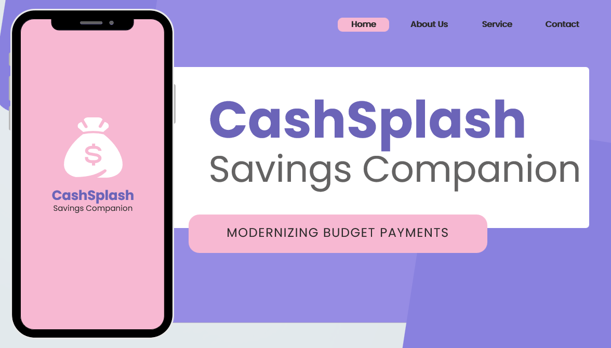
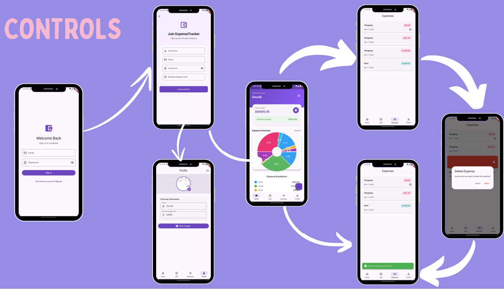
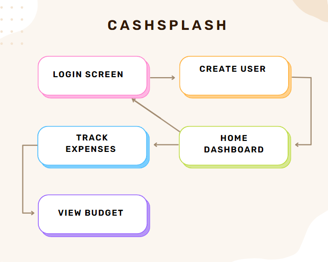
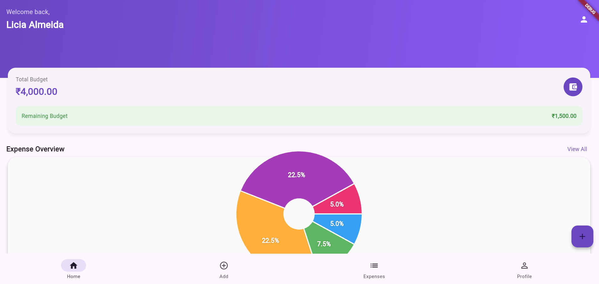
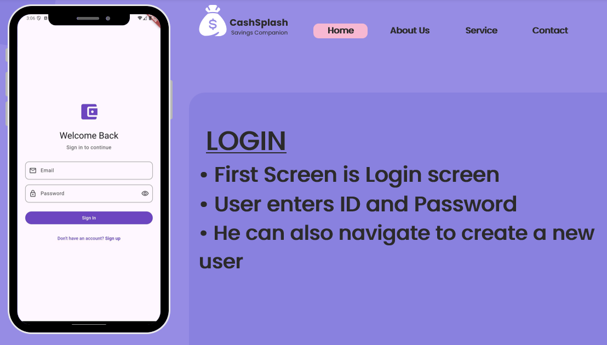
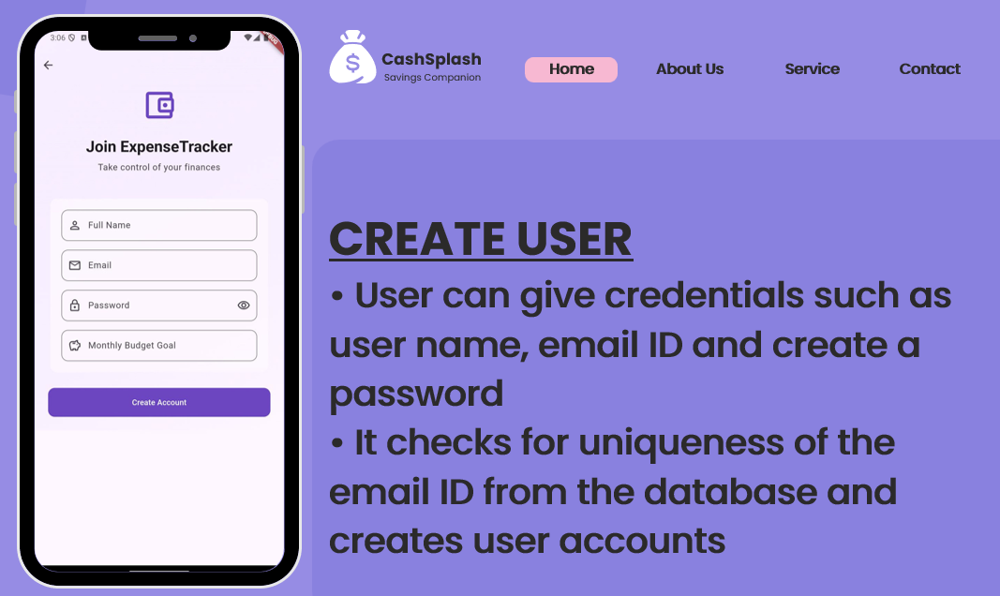
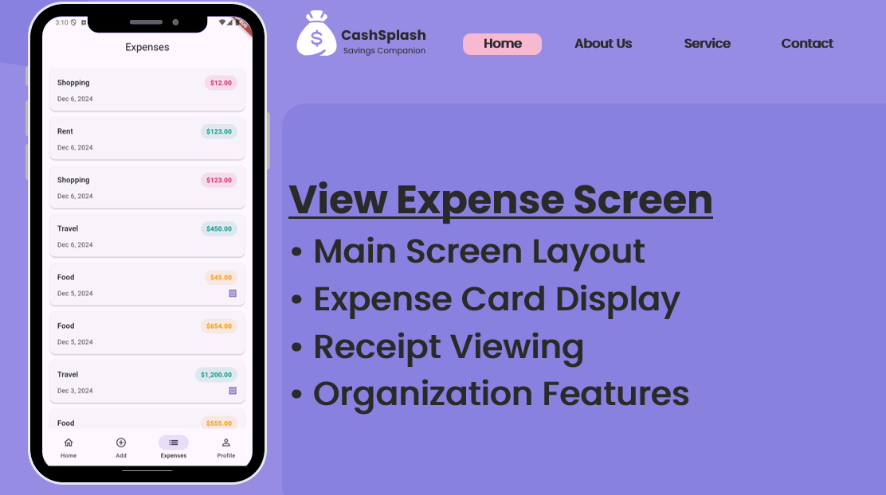
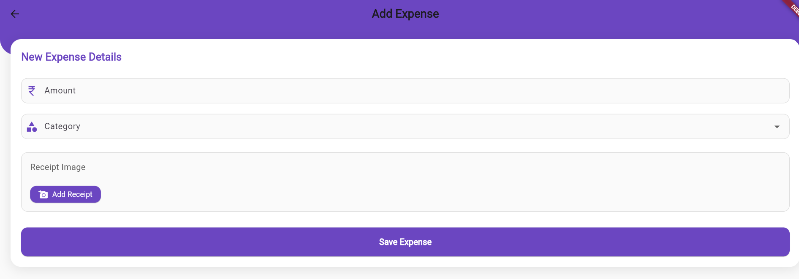
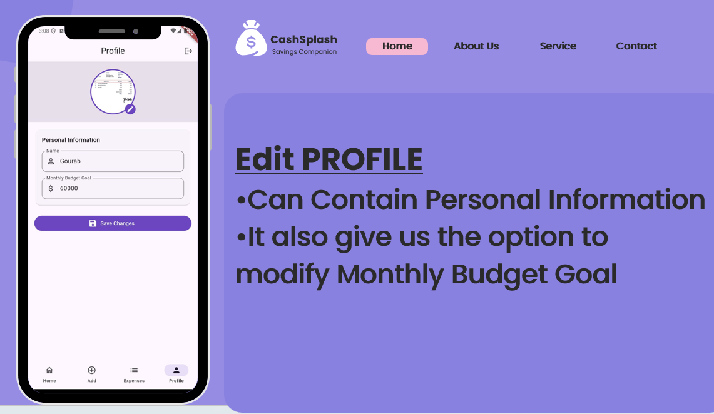
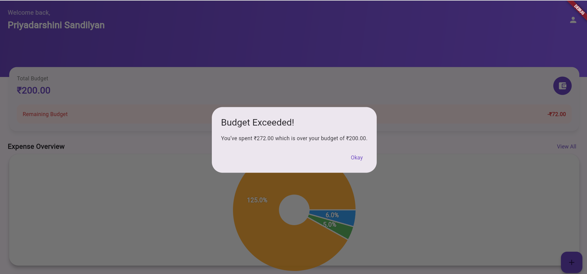

<p align="center">
  
</p>

# 💸 CashSplash — Savings Companion

**A Flutter + Firebase mobile app that modernizes personal budgeting: real-time expense tracking, budget goals, and savings visualization — with offline support.**


---

## 📖 Table of Contents

- [Overview](#-overview)
- [Team](#-team)
- [Problem Definition](#-problem-definition)
- [Aims & Objectives](#-aims--objectives)
- [Scope of the Project](#-scope-of-the-project)
- [System Design & Methodology](#-system-design--methodology)
- [App Screens](#-app-screens)
- [Hardware, Software & Cloud Platforms Used](#-hardware-software--cloud-platforms-used)
- [Implementation Methodology](#-implementation-methodology)
- [Tech Stack](#-tech-stack)
- [Suggested Repository Structure](#-suggested-repository-structure)
- [Getting Started](#-getting-started)
- [Conclusion](#-conclusion)
- [Future Scope](#-future-scope)
- [Constraints for Real-Time Deployment](#-constraints-for-real-time-deployment)
- [References](#-references)
- [Acknowledgements](#-acknowledgements)
- [License](#-license)

---

## 📖 Overview

The digital transformation of personal finance management is reshaping how individuals monitor expenses, create budgets, and pursue financial goals. **CashSplash — Savings Companion** is a mobile-based personal finance application designed to give users greater control over both daily expenditures and long-term money management.

Featuring real-time expense tracking, customizable budget planning, and intuitive savings-goal visualization, CashSplash helps users make smarter, better-informed financial decisions. Built on **Firebase** for backend scalability, real-time data syncing, and offline functionality, the app stays usable even in low-connectivity scenarios. With a clean interface, secure authentication, detailed transaction logging, and insightful expense breakdowns, CashSplash modernizes traditional budgeting and encourages healthier financial habits.

> Mini-project — MAD & PWA Lab (ITL604), TE Information Technology, Semester VI, AY 2024–2025, Xavier Institute of Engineering, University of Mumbai.

---

## 👥 Team

| Name | Roll No. |
|---|---|
| Licia Almeida | 202203005 |
| Janaki Bal | 202203007 |
| Shravani Jadhav | 202203028 |
| Priyadarshini Sandilyan | 202203004 |

**Guided by:** Ms. Stella J. (Assistant Professor, Department of Information Technology)

---

## 🎯 Problem Definition

In today's fast-paced digital era, managing personal finances efficiently has become a growing challenge. Many people still rely on manual methods — notebooks or basic spreadsheets — to track expenses and savings, which are error-prone and lack real-time accessibility. The absence of automated tracking, categorized budgeting, and visualization tools often leads to overspending and poor savings discipline. Existing financial apps may also lack personalized features, offline access, or intuitive design. There's a need for a modern, accessible, intelligent mobile solution that empowers users to monitor, plan, and control their finances effectively.

## 🎯 Aims & Objectives

- Design and develop a mobile application, **CashSplash – Savings Companion**, for personal finance management
- Enable users to track daily expenses, plan monthly budgets, and set long-term savings goals
- Implement secure user login, receipt viewing, and expense breakdown visualization
- Integrate Firebase for real-time backend support and offline functionality
- Deliver a simple, user-friendly interface that supports financial literacy and planning

## 🔭 Scope of the Project

The scope covers development of an **Android-based** mobile app focused on personal budgeting and expense management: user authentication, transaction entry, budget monitoring, savings-goal tracking, and expense categorization. The app supports both online and offline modes using Firebase as the backend. Scope also extends to UI design, functionality testing, and consideration of future enhancements like AI-based financial advice and shared budgeting.

**Out of scope (current version):** direct financial transactions or integration with external banking APIs.

---

## 🧭 System Design & Methodology

### App navigation flow (Fig. 1)

The app's navigation is structured around six primary stages: **Login Screen → Create User → Home Dashboard → Track Expenses / Edit Profile / View Budget**, all backed by Firebase Realtime Database.



1. **Login Screen** — entry point; existing users log in via Firebase Authentication, and can navigate to Home or Create User
2. **Create User** — first-time users register with basic details, then redirect to Home
3. **Home Dashboard** — central hub showing current budget status, expense summary, and navigation to other modules
4. **Track Expenses** — users log daily expenses (amount, category), stored in Firebase Realtime Database
5. **Edit Profile** — update user information / reset credentials
6. **View Budget** — visual graphs and budget targets fetched from Firebase; notifies users when a spending threshold is crossed

### Block diagram (Fig. 2)



The design is structured around smooth user navigation and modular functionality to ensure seamless financial tracking — starting with authentication and flowing through expense tracking, savings goals, and budget overview.

---

## 📱 App Screens

**Home Screen (Fig. 4)** — total budget, remaining budget, expense-overview pie chart, and a categorized expense breakdown:



**Login Page (Fig. 6)** — Firebase Authentication–backed sign-in, with a path to create a new account:



**Create User** — new users register with name, email, password, and an initial monthly budget goal:



**Expense List (Fig. 3)** — chronological list of logged expenses by category, amount, and date:



**Add Expense (Fig. 7)** — log a new expense with amount, category, and an optional receipt image:



**Edit Profile (Fig. 5)** — update personal information and monthly budget goal:



**Budget Exceeded Notification (Fig. 8)** — alerts the user in real time once spending crosses the set budget:



---

## 🛠️ Hardware, Software & Cloud Platforms Used

| Component | Specification |
|---|---|
| Device | Android smartphone |
| OS | Android 10+ |
| IDE | Android Studio |
| Language | Dart (using Flutter framework) |
| Database | Firebase Realtime Database |
| Authentication | Firebase Auth |
| Design Tools | Dart Widgets (Flutter UI Components) |

---

## ⚙️ Implementation Methodology

To solve the problem of manual expense tracking and budgeting, the app was built using Flutter and Firebase, in the following steps:

1. **Firebase Setup** — created a Firebase project and integrated it with the Flutter app for auth + real-time database support
2. **User Authentication** — Login and Sign-Up screens via Firebase Authentication for secure registration/access
3. **User Interface Design** — Home, Add Expense, View Expenses, and Profile Settings screens built with Flutter widgets for a smooth, responsive, platform-independent UI
4. **Expense Management** — daily expenses stored in Firebase Realtime Database under each user's unique ID, fetched and displayed in real time
5. **Budget Goal & Visualization** — users set a monthly budget goal; the app computes remaining budget and visualizes spending via pie charts and percentage indicators
6. **Receipt Upload & Viewing** — optional receipt upload as base64-encoded images, viewable later in-app
7. **Navigation & User Flow** — smooth screen-to-screen navigation via Flutter's Navigator and page transitions
8. **Notification System** — budget alerts via `flutter_local_notifications` when users approach their spending limits

---

## 🛠️ Tech Stack

- **Framework:** Flutter (Dart)
- **Backend / Database:** Firebase Realtime Database
- **Authentication:** Firebase Auth
- **Notifications:** flutter_local_notifications
- **IDE:** Android Studio
- **Target Platform:** Android 10+

**Key app modules (Dart files):** `main.dart`, `login_screen.dart`, `signup_screen.dart`, `animated_splash_screen.dart`, `home_screen.dart`, `add_expense_screen.dart`, `view_expense_screen.dart`, `expense_model.dart`, `expense_service.dart`, `expense_data.dart`, `budget_pie_chart.dart`, `budget_notification_service.dart`, `profile_setting_screen.dart`, `firebase_options.dart`

---

## 📁 Suggested Repository Structure

Based on the modules documented in this project — adjust to match your actual repo layout:

```
cashsplash/
├── README.md
├── assets/                          # Images used in this README
├── lib/
│   ├── main.dart
│   ├── firebase_options.dart
│   ├── screens/
│   │   ├── animated_splash_screen.dart
│   │   ├── login_screen.dart
│   │   ├── signup_screen.dart
│   │   ├── home_screen.dart
│   │   ├── add_expense_screen.dart
│   │   ├── view_expense_screen.dart
│   │   └── profile_setting_screen.dart
│   ├── models/
│   │   └── expense_model.dart
│   ├── services/
│   │   ├── expense_service.dart
│   │   └── budget_notification_service.dart
│   ├── data/
│   │   └── expense_data.dart
│   └── widgets/
│       └── budget_pie_chart.dart
├── android/                          # Android platform project (Android Studio)
├── pubspec.yaml
└── LICENSE
```

## 🚀 Getting Started

> Adjust these commands to match your actual project setup.

```bash
# 1. Clone the repository
git clone https://github.com/<your-username>/cashsplash.git
cd cashsplash

# 2. Install Flutter dependencies
flutter pub get

# 3. Set up Firebase
#    - Create a Firebase project (Firebase Console)
#    - Enable Firebase Authentication (Email/Password) and Realtime Database
#    - Add your Android app to the Firebase project and download google-services.json
#      into android/app/
#    - Run flutterfire configure to (re)generate firebase_options.dart

# 4. Run the app on a connected device / emulator
flutter run
```

---

## ✅ Conclusion

CashSplash effectively fulfills the need for a modern, personalized, user-friendly financial tracking tool for mobile platforms. It lets users securely register, set monthly budget goals, log daily expenses, and track their remaining budget. With visual expense breakdowns, budget alerts, and receipt uploads, the app encourages better financial awareness and planning. Built with Flutter and Firebase, it's scalable, responsive, and easy to use even for non-technical users.

## 🔮 Future Scope

- AI-based financial insights and budgeting suggestions
- Integration with UPI or bank accounts for automated transaction logging
- Multi-user budgeting and collaborative financial planning (families/roommates)
- Smart notifications and reminders for recurring expenses and bill payments
- Export/download monthly spending summaries as PDF reports

## ⚠️ Constraints for Real-Time Deployment

- Dependence on internet connectivity for Firebase real-time data sync
- Security and privacy risks in handling sensitive financial data
- Firebase's free-tier limitations on authentication, storage, and database usage
- Limited compatibility with older Android devices; no iOS support yet
- No integration with official banking APIs or payment gateways yet
- No biometric authentication yet (face/fingerprint login)

---

## 📚 References

1. [Firebase Documentation](https://firebase.google.com/docs) — Authentication and Realtime Database
2. Flutter Documentation — Widgets, Navigation, and State Management
3. [Android Developers Guide](https://developer.android.com)

## 🙏 Acknowledgements

- **Fr. Dr. John Rose S.J.**, Director, Xavier Institute of Engineering
- **Dr. Y. D. Venkatesh**, Principal, Xavier Institute of Engineering
- **Dr. Jaychand Upadhyay**, Head of Department, Information Technology
- **Ms. Stella J.**, Project Guide, Department of Information Technology
- The Information Technology Department staff at Xavier Institute of Engineering

## 📝 License

This project was developed as an academic mini-project (MAD & PWA Lab, ITL604). Add your preferred open-source license (e.g., MIT, Apache 2.0) here before publishing the code publicly.
